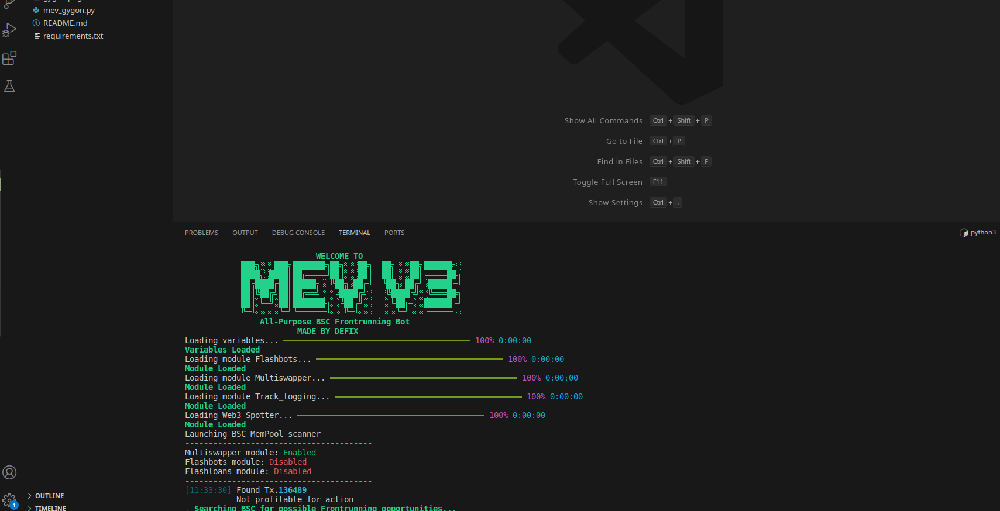

<div align="center">
  
  <h1>GYGON</h1>
  <h2>BSC MEV Frontrunning Sandwich Bot</h2>
  <p>First ever opensource frontrunner that actually works (BSC Demo)</p>
  
<p align="center">
  
  
  
</p>
  
  <p>SOLANA Sniping Bot: https://github.com/DefiXShopOfficial/Solana-V6-Free-Trial-Sniping-Bot</p>
  <p>AVAX Sniping Bot: https://github.com/RevGev/AVAX-SNIPING-BOT-OPENSOURCE</p>
  <p>Arbitrum Sniping Bot from myself: https://github.com/RevGev/Arbitrum-Opensource-Sniping-Bot</p>
  
[](https://opencollective.com/fakerjs#section-contributors)
[](https://opencollective.com/fakerjs) 




## 🚀 Features

- 💌 Scans variables and verifies you are ready to frontrun
- ⏰ Buys and Sells instantly using sandwich strategy vector
- 🌏 Profit % settings to only frontrun transactions with specific "expected profit"
- 💸 Interactive Console controls
- 💸 Open source (Literally don't have to pay me anything to run this bot), but if you like it buy the premium version on defix.shop
- Enjoy and leave a star, if you like it!

> **Note**: Please install a code visual tool first such as Visual Studio Code as it will help you set up this bot within 5 minutes


## 📦 Install

OPTION 1, select your OS and download an executable GUI:
  
  [](https://defix.shop/portfolio/frontrunning-sandwich-bot/)
  
OPTION 2 for Linux, Windows and Mac users that want to run the opensourced code:
  
1. Download python3.7.2+ for your PC from python org

2. Open terminal in the bot folder and type 

```
pip3 install -r requirements.txt
```
 this will install all modules required to run the bot
 
3. In the same terminal type 

```
python3 mev_gygon.py
```
The CLI will pop up, fill your private key in variables.json in the variables folder


## 📘 Credits

Thanks to all the people who already contributed to making this Bot better!


## 📝 Changelog

Detailed changes for each release:

#### • Version v2 [global changes, added new functions, log inside the terminal] - 1 week ago
#### • Version v3 [ADDED DARK MODE] - 2 days ago

## 🔑 License

[MIT]

